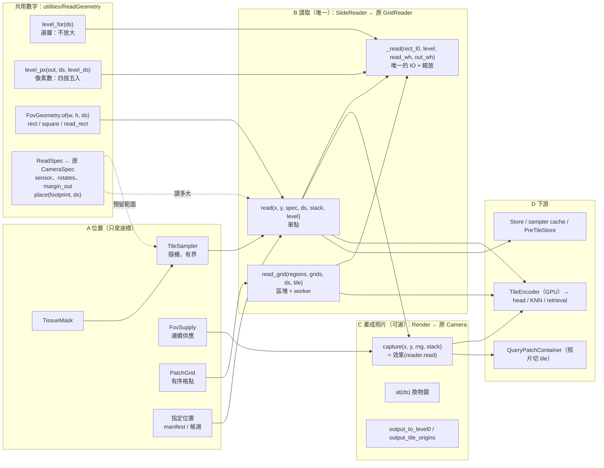

# LocaScope 架構

讀圖、渲染、encode 這三段由所有流程共用：訓練、window bench、正式 pipeline 都走同一套。
每個 stage 的**方法**可以替換，共用層只提供**能力**，不替方法做選擇。

## 從 WSI 取像素：責任劃分

不管是訓練、模擬還是正式 pipeline，取像素都是同一條流程，只差在選哪種位置、哪種讀法、哪種效果：

```
A 決定位置（只是座標）
  A1 隨機：在組織內，並預留相機要讀的範圍（mask + CameraSpec）
  A2 有序：grid（main + offset 格點）
  A3 指定：manifest、pipeline 候選、手動
  A4 連續供應：一批用完再抽下一批，抽完就重複（只有合成 query 用）
  A5 mask：決定「組織內」在哪裡（位置的輸入）

B 讀出像素
  B1 讀多大：sensor × ds，加上周邊（旋轉正方形 / 邊距）；sampler 共用同一個數字
  B2 來源解析度：目標 ds 要從哪一層來
       原生層剛好有 → 直接讀；沒有 → 讀較細的一層再縮小（不放大）；
       強制從更細的層讀（訓練的 resampled / l0 模式）；'R'：讀 ds 1 再退化到 ds
  B3 縮放：像素數怎麼捨入、用哪種濾鏡（lanczos / area）
  B4 讀取方式：單點、整塊（grid 加速）、任意矩形
  B5 讀取安全：越界回傳 None、掃描破洞補背景、破洞比例檢查（drop_holes）
  B6 多 process：每個 worker 各自開 handle；CPU 預算

C 畫成照片（可選）
  C1 效果：無 / 只旋轉 / 完整
  C2 可重現：同一個位置、同一輪得到同一張照片（rng 由位置衍生）
  C3 GT：照片上的像素對應 WSI 的哪裡（output_to_level0、tile 原點）

D 下游（不屬於讀取）
  D1 照片切 tile：真實和合成照片都要（QueryPatchContainer）
  D2 encode：結果留在 GPU，沒有寫檔就不搬回 CPU
  D3 快取 / 存檔：sampler cache、feature store、pre-tile store
```

## 架構（2026-10-03 起）

### 架構



```
                ┌────────────── 共用數字：ReadGeometry ──────────────┐
                │ level_for（選層）  level_px（像素數）  FovGeometry    │
                │ ReadSpec（讀多大：sensor、旋轉、邊距）← 原 CameraSpec │
                └───────────────┬────────────────────┬───────────────┘
                                │ sampler 預留範圍     │ 讀取器照著讀
                                ▼                    ▼
A 位置                          B 讀取（唯一）                     C 畫成照片（可選）          D 下游
TissueMask ─► TileSampler ──┐   SlideReader  ← 原 GridReader      Render  ← 原 Camera
              (隨機、有界)   │   [吸收 QueryFromWSI、               [只剩效果 + GT]
FovSupply（連續供應）────────┼─►  Render.py 的讀取]                 ├─ capture(pos)          ┌► TileEncoder（GPU）
PatchGrid（有序格點）────────┤   ├─ read(pos, spec, ds,            │    = 效果(reader.read)  │   → head / KNN /
指定位置（manifest、候選）───┘   │        margin, stack)  單點      ├─ at(ds)  換物鏡        │     retrieval
                                ├─ read_grid(region, grid, ds)    ├─ output_to_level0  GT  │
                                │        區塊 + worker（原演算法） ├─ 效果：none / 旋轉 / 完整├► QueryPatchContainer
                                │  （任意矩形 = read + 臨時 ReadSpec）└─ pipeline + augment/  │   （照片切 tile）
                                ├─ 選層 B2：level_for /                                      └► Store / 快取
                                │    強制 read_level / 'R' 退化
                                ├─ 縮放 B3：lanczos | area、degrade_resolution
                                └─ 安全 B5：越界 → None、破洞 → SafeSlide
                                     └─ worker 數由 CpuBudget 決定（B6）
```

實例變數照舊叫 `camera`；`SlideReader` 的實例叫 `reader`。

### 介面

座標一律是 level-0；倍率一律是 ds（相對 level 0）。mpp 只在呼叫端換算一次（`ds = mpp / base_mpp`）。

```python
# ── utilities/ReadGeometry.py（ReadSpec 改名，其餘不動）───────────────────
@dataclass(frozen=True)
class ReadSpec:                      # 原 CameraSpec，欄位與行為不變
    sensor_w: int; sensor_h: int     # 輸出像素
    rotates: bool = False            # True：讀外接正方形（旋轉需要）
    margin_out: int = 0              # 不旋轉時四周多讀的輸出像素（光學效果、pre-tile）
    long_side / square / key() / geometry(ds) / fov_offset(box, fw, fh)
    place(footprint_l0, ds) -> (fov_w_l0, fov_h_l0, reserve_l0)    # sampler 預留範圍
# level_for / level_px / FovGeometry / ReadRect / reserve_margin：不動

# ── utilities/SlideReader.py（原 GridReader.py，大改）───────────────────────
@dataclass(frozen=True)
class ReadPlan:                      # 一次讀取的全部決定，不碰 IO
    rect: ReadRect                   # level-0 範圍（原點 + 要落在 slide 內的範圍）
    level: int
    read_wh: Tuple[int, int]         # level 像素
    out_wh: Tuple[int, int]          # 輸出像素

class SlideReader:
    def __init__(self, slide: SafeSlide | str, *, resize='lanczos' | 'area',
                 workers: int = 0): ...
    slide; path; base_mpp; level_downsamples

    def level_of(self, ds, level=None) -> int      # level_for(ds)，或檢查強制的 level 不比 ds 粗
    def native(self, ds, level=None) -> bool       # 這個 ds 從它的層讀出來不必縮放？
    def plan(self, x, y, spec: ReadSpec, ds, *, level=None) -> ReadPlan
        # (x, y) = sensor 長方形的 level-0 左上角
        # rotates → 外接正方形（square_out 輸出像素）；否則長方形 + margin_out
        # level=None → level_for(ds)；給定 → 檢查不比 ds 粗
    def read(self, x, y, spec: ReadSpec, ds, *, stack='F', level=None) -> np.ndarray | None
        # uint8 [H, W, 3]；越界 → None
        # stack='R'：plan(..., ds=1)（level 0）讀出，再 degrade_resolution(img, ds)
    def read_samples(self, samples, spec: ReadSpec) -> List[np.ndarray]
        # TileSampler 抽出的每個 sample，用它自己的 ds 和 stack 讀；越界直接報錯
    def read_grid(self, regions, grids, ds, *, tile, offset=True, block_rows=8,
                  level=None) -> GridRead           # 可迭代出 GridBlock
        # 原 GridReader：整數 ds → N 列一塊；非整數 ds → 每個 region 只讀一次再切，
        # 不同 region 分給不同 worker 平行讀；ds 必須是某一層自己的 ds
        # workers > 0：DataLoader，每個 worker 各自開 SafeSlide
    def _read(self, plan: ReadPlan) -> np.ndarray      # 唯一的 read_region_rgb + resample

class GridRead:                      # read_grid 的回傳值
    __iter__ -> GridBlock；__len__（block 數）；n_tiles；one_read_per_region

@dataclass
class GridBlock:                     # 原 GridReader.GridBlock，不變
    region: int; row0: int; cols: int; main_rows: int; offset_rows: int
    main: torch.Tensor               # uint8 [main_rows * cols, tile, tile, 3]
    offset: Optional[torch.Tensor]

def resample(img, w, h, method) -> np.ndarray          # 原 Render.py
def degrade_resolution(img, ds, out_side) -> np.ndarray  # 原 Render.py；ChainStack 直接從這裡匯入

# ── query_sim/camera.py（Camera → Render，大改）─────────────────────────────
def sensor_size(wh_ratio, MPixels) -> (w, h)           # 原 source/wsi_query.py
def rotates_for(cfg, rotation=None) -> bool             # 不動
def render_spec(cfg, sensor) -> ReadSpec                # 原 camera_spec
def tile_spec(tile, margin_out=0) -> ReadSpec           # 不旋轉的 tile（參考、pre-tile）

class Render:                        # 實例名 camera
    def __init__(self, reader: SlideReader, cfg: DomainGapConfig, *,
                 ds=None, seed=None, read_level=None): ...
        # ds=None → cfg.query_mpp / base_mpp；sensor 由 cfg.wh_ratio / MPixels
    reader; cfg; ds; level; spec -> ReadSpec; output_w/h; rect_w_l0/h_l0; reads_natively
    def at(self, ds) -> 'Render'                       # 同一個 reader、同一份 cfg，快取
    def capture(self, x, y, rotation=None, rng=None, stack='F') -> np.ndarray | None
    def capture_with_gt(self, x, y, rotation=None, rng=None, stack='F') -> (img, params)
        # raw = reader.read(x, y, self.spec, self.ds, stack=stack, level=read_level)
        #   （是否旋轉由 rotates_for(cfg, rotation) 決定 spec.rotates）
        # → simulate_with_gt(raw, cfg, rng, rotation, output_wh)
    def output_to_level0(...) / output_tile_origins(...)   # 不動
    # 沒有 read()：不要效果就直接 reader.read(x, y, tile_spec(...), ds)

# ── query_sim/generator.py（FovSupply：只換型別）─────────────────────────────
class FovSupply:
    def __init__(self, camera: Render, mask, cfg=None, plan=None)   # 其餘不動
def fov_plan_of(camera: Render) -> RungPlan

# ── training/MppRoutingHead/Datasets.py（CameraBank：只換建構方式）─────────────
class CameraBank:
    def reader_for(dataset, wsi_name) -> SlideReader    # 每張 WSI 一個（原 _wsi_for）
    def camera_for(dataset, wsi_name, rung, *, native=False, read_level=None) -> Render
```

呼叫端的寫法（取代 `read_tiles` / `Sample.materialise` / `QueryFromWSI.crop`）：

```python
reader = SlideReader(wsi, resize='area')
tiles = reader.read_samples(sampler, tile_spec(256))          # 每個 sample 用自己的 ds、stack
pre   = reader.read(m.x, m.y, tile_spec(256, centre_margin(256, 3)), m.ds)
win   = reader.read(x0, y0, ReadSpec(w_out, h_out), ds)          # 原 read_rect
camera = Render(SlideReader(wsi), CAMERA_FULL, ds=rung); camera.capture(x, y, rng=rng)
```

### 各流程怎麼取像素

流程只有一套（位置 → 讀取 → 效果 → 下游），差別只在選項：

```
位置來源          讀取                                 效果       下游
─────────────────────────────────────────────────────────────────────────
訓練 query         隨機    → reader.read（旋轉正方形）   → 完整    → encoder → head
訓練 support       隨機    → reader.read（旋轉正方形）   → 只旋轉  → encoder → head
Stage 1 參考庫     隨機    → reader.read（area）         → 無      → encoder → KNN
query_sim         FovSupply → reader.read                → 完整    → PNG + gt.csv
window bench 參考  格點    → reader.read_grid            → 無      → encoder → 分數
pre-tile          隨機    → reader.read（邊距、area）     → 無      → PreTileStore
pipeline 參考      格點    → reader.read_grid            → 無      → retrieval   ← pipeline 遷移時改
stage 3           候選    → reader.read（臨時 ReadSpec） → 無      → SIFT        ← 之後改
真實照片           —                                     —         → 切 tile → stage 1/2/3
```

### 2026-10-03 這次怎麼改的

先在 `diag_read_exp.py` 把要改的部分完整寫一遍，和當時的正式程式並排跑過
（566/566 次讀取逐像素相同、14/14 項速度不變慢，`result/DiagReadExp/DiagReadExp/`），才搬進正式檔案。

| 動作 | 對象 |
|---|---|
| 刪除 | `query_sim/source/`（QueryFromWSI）、`query_sim/QueryFromWSI.py`、`utilities/Render.py`、`utilities/GridReader.py`、`utilities/SlideContext.py`、`diag_render_reads.py` + `DiagRenderReads.sh`、`test_grid_reader.py`、`test_read_equivalence.py`、`test_generator.py` 的 equiv 段、`CameraTest.sh` |
| 新增 | `utilities/SlideReader.py`、`test_slide_reader.py`（read + grid） |
| 大改 | `Camera` → `Render`：不自己讀圖，向 SlideReader 拿原始像素，只負責效果、可重現性和 GT |
| 改名 | `CameraSpec` → `ReadSpec`；`camera_spec` → `render_spec`；`Corpora.pretile_camera` → `pretile_spec` |
| 合併 | `CameraTest.sh` 併入 `TestReadPath.sh`；`diag_read_exp.py` 改成讀取路徑的速度量測 |
| 小改（呼叫端） | 訓練 CameraBank、KnnEstMpp、PrototypeEstMpp、extract_pretiles、ChainStack、FewShotEoMT、generator、multi_batch、demo、各 bench、diag、相關測試 |
| 不動 | TileSampler（只拿掉 degrade 的再匯出）、DsLadder、PatchGrid、TissueMask、ReadGeometry 的規則、augment、TileEncoder、CpuBudget、Store |
| 之後才改 | WsiTileLoader、SlideWinSift 改用 SlideReader（WsiTissuesContainer 已於 2026-10-06 淘汰）；A 的命名（TileSampler、SampleMeta、FovSupply） |

讀取模組從 Camera、QueryFromWSI、轉接檔、Render.py、GridReader、SlideContext 六個減為 Render、SlideReader 兩個。
被刪掉的檔案在本次 session 的 scratchpad 有備份（`removed_2026-10-03/`），scratchpad 不是永久的。

### 為什麼 read_grid 不能用 read 迴圈做

1. 速度：一個 tile 讀一次約 270 tiles/s；整塊讀再切加 worker 約 1060 tiles/s。
2. 結果：ds 不是整數時（BRACS 4.00014），openslide 依每次讀取的原點各自做次像素內插，
   逐 tile 讀和整區讀再切會差一點（特徵最多差 0.079）。現有的參考特徵都是整區讀再切。
   所以 `read_grid` 的定義是「整區（或整塊）讀一次再切」；整數 ds 時和逐點 `read` 逐像素相同。

任意矩形（stage 3、SIFT）不需要第三個介面：`read(x0, y0, ReadSpec(w_out, h_out), ds)`。

### 加速：保留什麼、放在哪裡

| 加速 | 量到的效果 | 新架構中的位置 |
|---|---|---|
| CPU 預算 | bench 7 倍、訓練 encode 3 倍 | `CpuBudget`（不動）；`SlideReader(workers=...)` 的數量從這裡取 |
| 整塊讀取 + worker | 約 270 → 1060 tiles/s | `SlideReader.read_grid`（原 GridReader 演算法原封不動） |
| 非整數 ds 整區讀一次 | 相位一致 | 同上；不同 region 分給不同 worker 平行讀。單一大 region 只能一次讀完（相位），是 BRACS_1228 L1 只有 313 tiles/s 的原因 |
| 不旋轉只讀矩形加邊距 | 讀取面積少約 2.1 倍 | `Render.spec.rotates` 由 `rotates_for(cfg)` 決定，`SlideReader.plan` 照著讀 |
| handle 共用 | 不重複開檔 | 每張 WSI（每個 process）一個 `SlideReader`；`Render.at(ds)` 共用它 |
| encoder 吃 uint8、GPU 前處理、結果留 GPU | 訓練輸入約 25 → 151 tiles/s | `TileEncoder`（不動）；`GridBlock` 直接是 uint8 張量 |
| 擴增優化版本、fp16 encoder、各種 cache | — | 不動 |

統一之後順便可以加速、但**這一輪不做**的：Stage 1 參考庫和 pre-tile 改成平行讀取；
PrototypicalRoutingHead 的渲染移到 DataLoader worker；pipeline 改用 `read_grid`（原型量到 362 → 118 s）。

## 入口與 stage

```
入口
├─ utilities/LocaScopePipeline                    尚未改用新的讀取（pipeline 遷移時改）
│   ├─ stage 1  mpp 估計        KnnEstMpp / ClassifierEstMpp / PrototypeEstMpp / classic
│   ├─ stage 2a 粗檢索          SlidingWinSimRot；graph / FAISS (未實作)
│   │                            build(ctx, level) → retrieve(query) → CandidateSet(K)
│   ├─ stage 2b 重排序          raw cosine / transformer (未實作)，可略過
│   │                            rerank(query, CandidateSet) → CandidateSet(K′)
│   └─ stage 3  定位            SiftRansacLocalizer；SuperPathPoint (未實作)
│   每個 stage 方法在自己的 config 指定 encoder、head、pooling；不同 stage 可以用不同 encoder
│   stage 2 的兩段式設計見 stage2_retrieval/spec.md
├─ training/MppRoutingHead/cli/{train,evaluate}.py  啟動時套用 CpuBudget
├─ utilities/bench_modules/bench_window_retrieval  CpuBudget、SlideReader.read_grid、特徵留在 GPU
└─ query_sim CLI
```

## 三條流程

```
訓練（MppRoutingHead / PrototypicalRoutingHead）
├─ CpuBudget：N 個 worker，主 process 用剩下的 thread（8 CPU、8 worker → 1）
├─ build_manifest → TileSampler(PlanSpec('ladder', rungs, routing_camera(tile))) → sampler cache
└─ 每個 epoch
    ├─ DataLoader(N 個 worker)：CameraBank → Render(reader, ds=rung).capture → uint8 patch
    │   Prototypical 仍在主 process 渲染（未改）
    └─ 主 process：encode_raw → TileEncoder（GPU 前處理，token 留在 GPU）→ Head → loss

window bench
├─ 每個 shard：CpuBudget(processes = shard 數)
└─ 每張 slide、每個 level
    ├─ FovSupply(Render, mask, SamplerConfig).bank() → FoV shot → query 特徵（GPU）
    └─ SlideReader.read_grid（N 列一塊 + worker）→ pooled_descriptors（GPU，不搬 CPU）
       → row_cosines → WindowAccumulator（GPU）
    parts 目錄的 config_id 加上 fov_reserve，舊 FoV 的 parts 不會被續跑

正式 pipeline（LocaScopePipeline）
├─ build：mask，三個 stage 綁定 slide（每個 stage 自己建 encoder）
├─ 第一次用到某個 level：SlideReader.read_grid（N 列一塊）→ WsiFeaturesMap.from_grid_read
│    （feature cache 命中就不讀圖）
└─ 每張照片：stage 1 → stage 2（4 個旋轉）→ stage 3（SlideReader 讀候選窗的 crop，level-0 記帳）
```

## 量測依據（`diag_render_reads.py`，2026-10-03 已刪除；之後的量測用 `diag_read_exp.py`）

| 流程 | 改前 | 改後原型 | 數字是否不變 |
|---|---|---|---|
| window bench，每個 process（2 個 shard 共用 8 CPU） | 41.7 tiles/s | ~410 tiles/s | window 分數差值 0（raw 7e-10） |
| pipeline 的 level build（BRACS_310 L0，98k tiles） | 362 s | 118 s | 特徵差值 0 |
| 訓練輸入（bracs/train 8 張，含 encode） | 99.5 / 25.3 tiles/s（Mpp / Proto） | 151 tiles/s | 渲染影像相同；token cos 0.99998 |
| 讀到切片外的位置（bracs/test） | manifest 19/1497，Camera 自己的 sampler 10/1500 | 0 | — |

瓶頸分別是：
- CPU 互搶：thread 數超過 CPU 數，bench 慢 7 倍，訓練 encode 慢 3 倍。
- 逐列讀圖。
- PIL 前處理和 worker 搶 CPU。
- 不必要的 GPU↔CPU 來回搬運。

訓練的下一個瓶頸是擴增（C1，CPU，8 個 worker 時約 150/s）。

## 原則

- **沒有要寫 cache 或寫檔，就不搬到 CPU。** encoder 的輸出在哪裡產生，就在哪裡用。
- **sampler 和 SlideReader 對同一次讀取只有一個定義**，也就是 ReadGeometry（ReadSpec）。
- **讀哪一層、讀幾個像素、用哪個濾鏡，整個專案各只有一個定義**：`level_for`、`level_px`、`SlideReader._read`。
  之前 Camera 會取比目標粗 5% 以內的層再放大，並把 level 像素截斷（BRACS ds 4.00014 讀 255 再放大成 256）。
- **CPU 預算由入口決定**，函式庫模組不自己改 thread 數。
- **共用層提供能力**（整張 grid 的特徵、任意範圍的像素、分散抽樣），選擇交給 stage 方法。

## 已知但刻意暫緩

- UNI2 的前處理和 upstream 不一致：現在是中心裁切，upstream 是縮放。見 `stage1_estimation/README.md`。
- GPU 擴增（C1）。
- CONCH 這類需要真正縮放的 encoder：GPU 前處理和 PIL 不是逐位元相同，差異量由 `test_tile_encoder` 量測。
